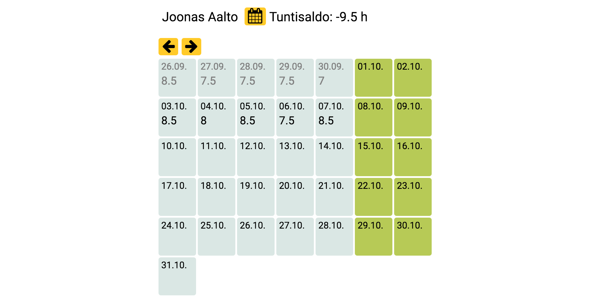

# finnish-harvest-hours

In Finland the standard work week is 37.5 hours. In the long term you are supposed to keep your logged hours within a reasonable margin of that standard. This app sums up the total amount of hours you have logged to [Harvest](https://www.getharvest.com/) and compares it to the standard hours, taking any national holidays into account.

### Requirements for local development

- [Elm](http://elm-lang.org/) 0.18.0
- [Elm-test](http://package.elm-lang.org/packages/elm-community/elm-test/latest)
- Heroku toolbelt: https://toolbelt.heroku.com/
- Node JS with ES6 support
- MongoDB (for storing user data and sessions)
- local-ssl-proxy: `npm install -g local-ssl-proxy`  
- nodemon: `npm install -g nodemon`
- an OAuth2 API client set up in Harvest
- `.env` file in project root with the required environment variables:
    - `SESSION_SECRET`: Express session secret
    - `CLIENT_ID`: Harvest API client id
    - `CLIENT_SECRET`: Harvest API client secret
    - `CALLBACK_URL`: Harvest API redirect URI, for local development this should be: https://localhost:5001/auth/callback
    - `ORGANIZATION`: Your organization name in Harvest
    - `IGNORE_TASK_IDS`: A comma-separated list of any Harvest task IDs you want to exclude from the total amount
    - `KIKY_TASK_IDS`: A comma-separated list of special KiKy task ids
    - `START_DATE`: Hour entries are calculated starting from this date. In `YYYYMMDD` format.

### Running locally

`./run-local`

Go to https://localhost:5001/

### Running tests

`elm-test`

### Requirements for deployment to Heroku

- an OAuth2 API client set up in Harvest
- the above environment variables need to be set up
- the following Heroku buildpacks:
    - https://github.com/srid/heroku-buildpack-elm
    - heroku/nodejs

